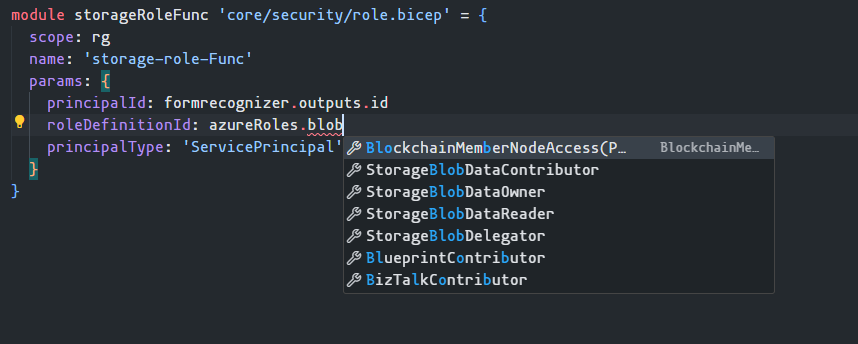
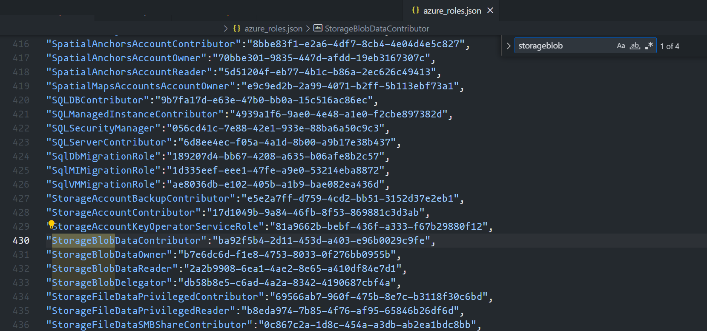

# Azure Roles

There are a lot of role GUIDs to remember or lookup. 

Make it easier on yourself.

Simplify using Azure's built-in roles in Bicep and Terraform

**How to**

1. Copy the "azure_roles.json" file from this repo
2. Make it available in your repo
3. Use the following example to leverage the JSON to make it easier when assigning Azure's built-in roles.
4. Lookup the role in the json, now you can use plain english in the bicep file to always know the role being assigned 
   1. FYI, you can use Visual Studio Code's auto-complete feature when enumerating the azureRoles var instead of looking it up in the json.


## Example

### Bicep

```bicep
// From main.bicep

// Parameters
param principalId string = ''
param principalType string = 'User'

// Variables
// Use Bicep's loadJsonContent to use Azure Roles JSON
var azureRoles = loadJsonContent('azure_roles.json')

// Resources
// Role assignment
resource openAiRoleUser 'Microsoft.Authorization/roleAssignments@2022-04-01' = {
  name: guid(subscription().id, resourceGroup().id, principalId, roleDefinitionId)
  properties: {
    principalId: principalId
    principalType: principalType
    roleDefinitionId: azureRoles.CognitiveServicesOpenAIUser
  }
}
```

### Terraform

```terraform
locals {
    # Use Terraform's jsondecode to use Azure Roles JSON
    azure_roles = jsondecode(file("${path.module}/azure_roles.json"))
}

data "azurerm_subscription" "primary" {
}

data "azurerm_client_config" "example" {
}
    
resource "azurerm_role_assignment" "example" {
  scope                = data.azurerm_subscription.primary.id
  role_definition_id   = local.azure_roles.CognitiveServicesOpenAIUser
  principal_id         = data.azurerm_client_config.example.object_id
}
```

## Use Case

### Enumerating in VS Code

You can autocomplete in line in VS code.


### Inline Search in VS Code

Beyond enumerating, you can search inline to find the appropriate role.



### Inline GUID Review

Hovering over the role will provide the GUID. Helpful if you are translating existing GUID into the JSON variable.


### Searching for role in JSON

You can always search through the JSON. Helpful if you are translating existing GUID into the JSON variable.


