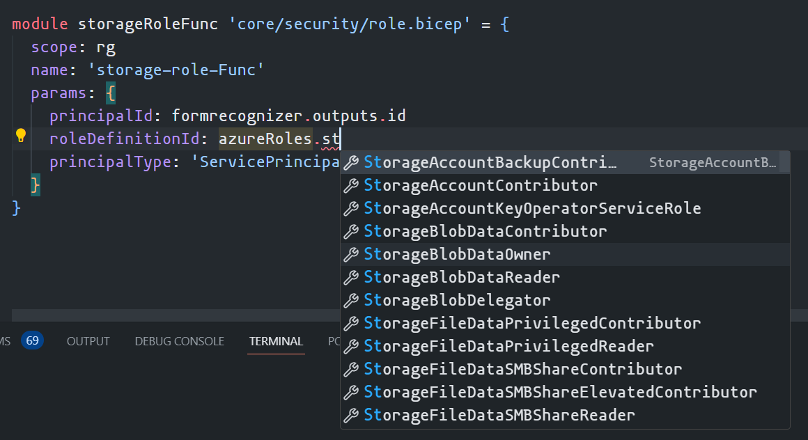

# Azure Roles

There are a lot of role GUIDs to remember or lookup. 

Make it easier on yourself.

Simplify using Azure's built-in roles in Bicep and Terraform

**How to**

1. Copy the "azure_roles.json" file from this repo
2. Make it available in your repo
3. Use the following example to leverage the JSON to make it easier when assigning Azure's built-in roles.
4. Lookup the role in the json, now you can use plain english in the bicep file to always know the role being assigned 
   1. FYI, you can use Visual Studio Code's auto-complete feature when enumerating the azureRoles var instead of looking it up in the json.


## Example

### Bicep

```bicep
// From main.bicep
// Use Bicep's loadJsonContent to use Azure Roles JSON
var azureRoles = loadJsonContent('azure_roles.json')

// role.bicep module
param principalId string = ''
param principalType string = 'User'
param roleDefinitionId string = azureRoles.CognitiveServicesOpenAIUser

resource openAiRoleUser 'Microsoft.Authorization/roleAssignments@2022-04-01' = {
  name: guid(subscription().id, resourceGroup().id, principalId, roleDefinitionId)
  properties: {
    principalId: principalId
    principalType: principalType
    roleDefinitionId: resourceId('Microsoft.Authorization/roleDefinitions', roleDefinitionId)
  }
}
```

### Terraform

```terraform
locals {
    # Use Terraform's jsondecode to use Azure Roles JSON
    azure_roles = jsondecode(file("${path.module}/azure_roles.json"))
}

data "azurerm_subscription" "primary" {
}

data "azurerm_client_config" "example" {
}
    
resource "azurerm_role_assignment" "example" {
  scope                = data.azurerm_subscription.primary.id
  role_definition_id   = local.azure_roles.CognitiveServicesOpenAIUser
  principal_id         = data.azurerm_client_config.example.object_id
}
```

## Use Case

### Enumerating in VS Code



### Searching for role in JSON


